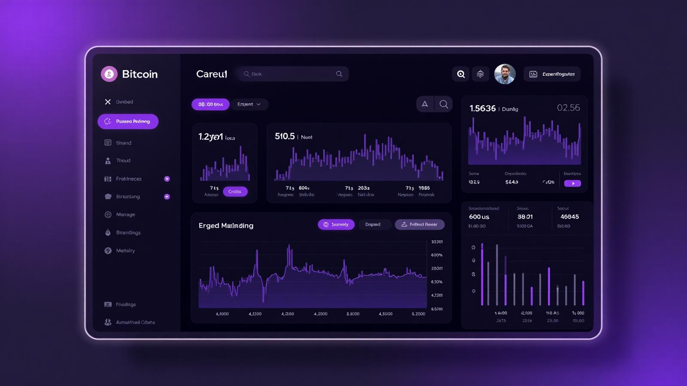

# 📊 Crypto Dashboard



**🔗 [Live Demo](https://your-app-name.lovable.app)** | **📱 [Try it now](https://your-app-name.lovable.app)**

A modern, real-time cryptocurrency dashboard built with React and TypeScript. Track market trends, monitor your favorite cryptocurrencies, and stay updated with the latest market data through an elegant glassmorphic interface.

## ✨ Features

### 📈 Real-Time Market Data
- **Market Overview**: Live market cap, 24-hour volume, and Bitcoin dominance statistics
- **Price Tracking**: Real-time price updates for top cryptocurrencies
- **Change Indicators**: Visual indicators showing price movements with color-coded arrows

### 📊 Interactive Charts
- **TradingView Integration**: Professional-grade Bitcoin price chart with full trading tools
- **Portfolio Performance**: 6-month Bitcoin price history with smooth line charts
- **Responsive Design**: Charts adapt seamlessly to different screen sizes

### 💼 Portfolio Insights
- **Performance Tracking**: Monitor Bitcoin's price movements over the last 180 days
- **Visual Analytics**: Clean, minimalist charts powered by Recharts
- **Historical Data**: Access to comprehensive price history via CoinGecko API

### 🎨 Modern UI/UX
- **Glassmorphic Design**: Beautiful glass-effect cards with subtle transparency
- **Dark Theme**: Easy on the eyes with a sophisticated dark color scheme
- **Smooth Animations**: Fade-in effects and smooth transitions throughout
- **Responsive Layout**: Optimized for desktop, tablet, and mobile devices

## 🚀 Getting Started

### Prerequisites
- Node.js (v18 or higher)
- npm or yarn package manager

### Installation

1. **Clone the repository**
   ```bash
   git clone <your-repo-url>
   cd crypto-dashboard
   ```

2. **Install dependencies**
   ```bash
   npm install
   # or
   yarn install
   ```

3. **Start the development server**
   ```bash
   npm run dev
   # or
   yarn dev
   ```

4. **Open your browser**
   Navigate to `http://localhost:5173` to view the dashboard

## 🛠️ Tech Stack

### Frontend Framework
- **React 18** - Modern React with hooks and functional components
- **TypeScript** - Type-safe development with excellent IDE support
- **Vite** - Lightning-fast build tool and development server

### Styling & UI
- **Tailwind CSS** - Utility-first CSS framework for rapid styling
- **Glassmorphism Design** - Modern design trend with glass-effect elements
- **Lucide React** - Beautiful, customizable icons
- **Custom Design System** - Consistent theming with semantic tokens

### Data & State Management
- **TanStack Query** - Powerful data fetching and caching library
- **CoinGecko API** - Reliable cryptocurrency data source
- **Auto-refresh** - Real-time updates every 30-60 seconds

### Charts & Visualization
- **TradingView Widget** - Professional trading charts and analysis tools
- **Recharts** - Responsive charts built on React and D3
- **Custom Tooltips** - Enhanced user experience with detailed hover information

## 📱 Components Overview

### Market Stats
Displays key market metrics in a three-column grid:
- Total market capitalization
- 24-hour trading volume  
- Bitcoin market dominance

### Crypto Chart
Professional TradingView widget featuring:
- Interactive Bitcoin price chart
- Multiple timeframe options
- Technical analysis tools
- Symbol switching capability

### Portfolio Card
Historical performance visualization showing:
- 6-month Bitcoin price trend
- Interactive tooltips with exact values
- Smooth line chart animations

### Crypto List
Top cryptocurrency table including:
- Real-time prices for top 5 coins
- 24-hour price change percentages
- Trading volume data
- Coin logos and symbols

## 🔄 Data Sources

- **CoinGecko API**: Free, reliable cryptocurrency data
- **TradingView**: Professional trading charts and market data
- **Auto-refresh**: Data updates automatically every 30-60 seconds
- **Error Handling**: Graceful fallbacks for API failures

## 🎨 Design Philosophy

This dashboard embraces a **modern glassmorphic design** that prioritizes:

- **Clarity**: Clean layouts that make complex data easy to understand
- **Elegance**: Subtle glass effects and smooth animations
- **Functionality**: Every element serves a purpose in the user's crypto journey
- **Accessibility**: High contrast ratios and intuitive navigation

## 🔧 Customization

The project is built with modularity in mind:

- **Component-based architecture**: Easy to modify or extend individual features
- **Tailwind configuration**: Customize colors, spacing, and animations
- **API integration**: Simple to add new data sources or endpoints
- **Responsive design**: Automatically adapts to different screen sizes

## 📊 Future Enhancements

Potential features for future development:
- User authentication and personal portfolios
- More cryptocurrency pairs and exchanges
- Price alerts and notifications
- Advanced technical analysis tools
- Mobile app version

## 🤝 Contributing

Contributions are welcome! Please feel free to submit a Pull Request. For major changes, please open an issue first to discuss what you would like to change.

## 📄 License

This project is open source and available under the [MIT License](LICENSE).

---

Built with ❤️ using React, TypeScript, and modern web technologies. Perfect for crypto enthusiasts who want a clean, professional dashboard to track their investments.